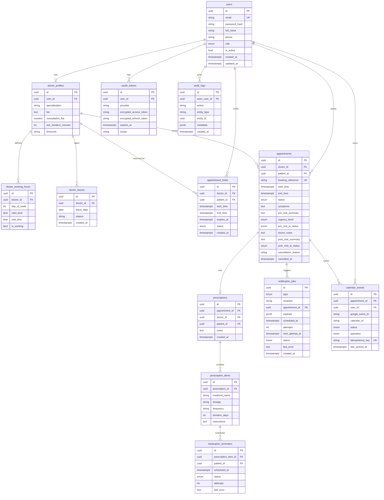

# Database Documentation

## Entity-Relationship Diagram



## Key Relationships

| Relationship | Cardinality | Notes |
|---|---|---|
| User → DoctorProfile | 1:0..1 | Only DOCTOR users have a profile |
| DoctorProfile → Appointments | 1:many | Via doctor_id |
| User → Appointments | 1:many | Patient bookings via patient_id |
| Appointment → Prescription | 1:0..1 | One prescription per appointment |
| Prescription → PrescriptionItems | 1:many | Medication line items |
| PrescriptionItem → MedicationReminders | 1:many | One reminder per dose |
| Appointment → NotificationJobs | 1:many | Outbox jobs |
| Appointment → CalendarEvents | 1:many | One per user (patient + doctor) |

## Critical Constraints

### Appointment hold exclusion
```sql
EXCLUDE USING gist (
    doctor_id WITH =,
    tstzrange(start_time, end_time, '[)') WITH &&
)
WHERE (status = 'HELD')
```
Prevents two HELD holds for the same doctor + overlapping time.

### Appointment exclusion (the critical one)
```sql
EXCLUDE USING gist (
    doctor_id WITH =,
    tstzrange(start_time, end_time, '[)') WITH &&
)
WHERE (status = 'CONFIRMED')
```
Database-level final authority against double-bookings.

### Medication reminder idempotency
```sql
UNIQUE (prescription_item_id, scheduled_at)
```
Prevents duplicate reminder jobs for the same dose.

### Calendar event idempotency
```sql
UNIQUE (idempotency_key)
-- idempotency_key = sha256(appointment_id + user_id + operation)
```
Prevents duplicate calendar operations on retry.
